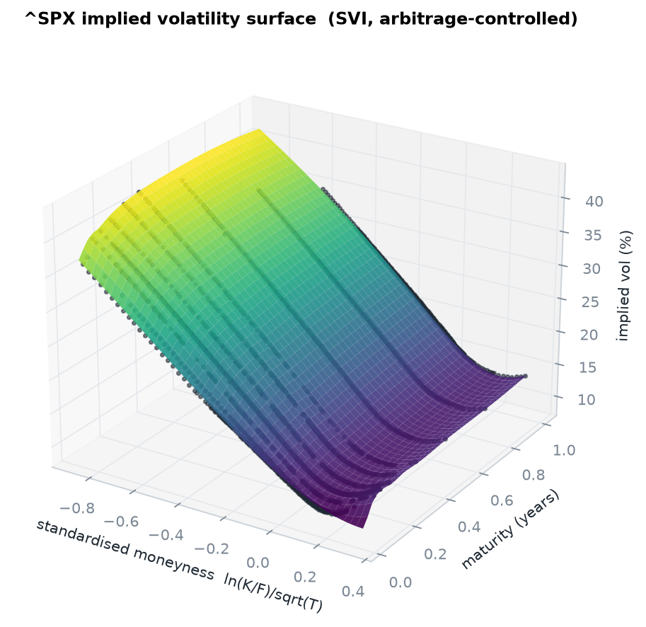
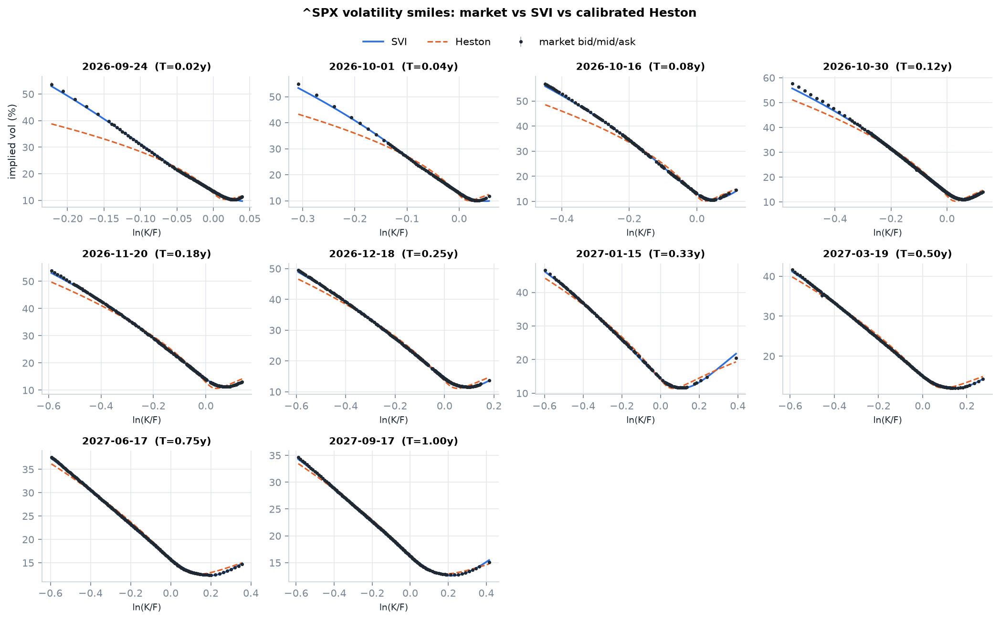
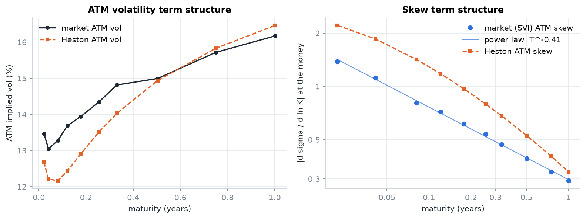
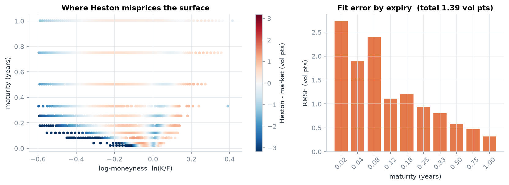
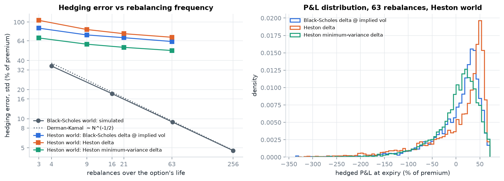
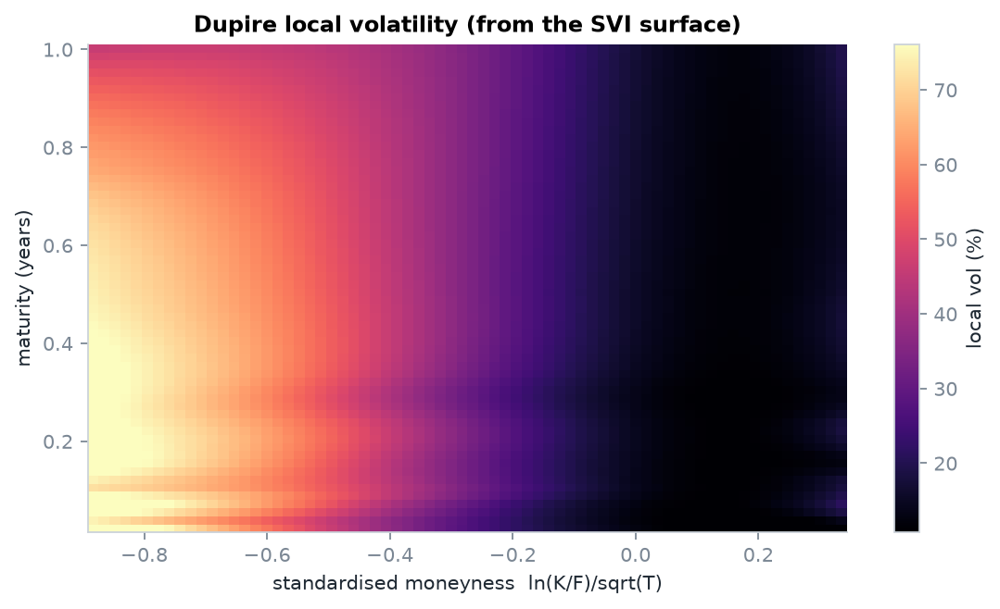
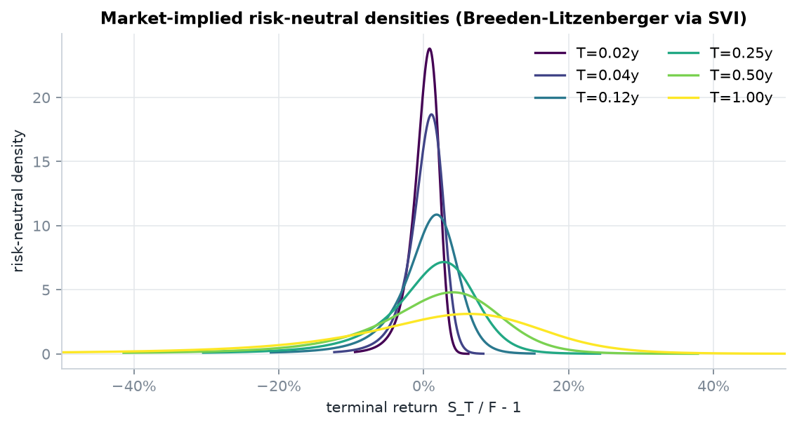
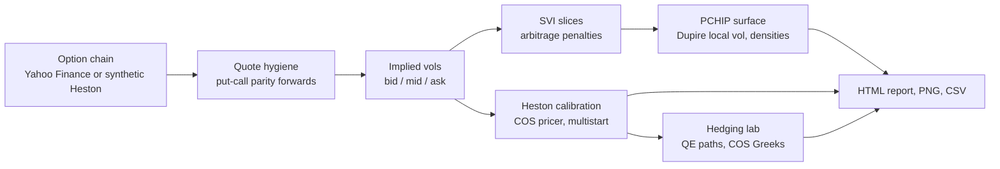

# Volatility Surface Lab

[](https://github.com/elmarfarajov/volatility-surface-lab/actions/workflows/ci.yml)


**From raw option quotes to an arbitrage-controlled volatility surface, a calibrated stochastic-volatility
model, and a measurement of how much risk a delta hedge actually removes.**

The project takes a live S&P 500 index option chain, extracts forwards and discount factors directly from
option prices, builds an SVI implied volatility surface with explicit no-arbitrage controls, derives Dupire
local volatility and risk-neutral densities, calibrates the Heston model with a Fourier-cosine pricer, and
then simulates thousands of hedged option books to quantify model risk. Every numerical engine is validated
against published reference values.



---

## Results on live S&P 500 options

Snapshot: `^SPX`, Yahoo Finance (delayed), 16 September 2026, spot 7,611.77, **10 expiries from one week to one
year, 2,113 cleaned out-of-the-money quotes**.

| Stage | Result |
|---|---|
| Forward extraction (put-call parity regression) | implied rates 4.4-4.9%, carry r - q 3.6-4.0%, i.e. an implied dividend yield of about 0.9% |
| SVI surface | per-expiry RMSE **0.13-0.37 vol pts**, calendar violation below 1e-5 in total variance |
| Heston calibration (5 parameters, under 15 s) | v0 = 0.021, kappa = 6.55, theta = 0.047, sigma = 2.17, rho = -0.69, **RMSE 1.39 vol pts**, Feller ratio 0.13 |
| Market skew term structure | ATM skew decays as **T^-0.41** |
| Hedging lab (3-month ATM call, 6,000 paths) | daily-rebalanced hedging error: **9%** of premium in a Black-Scholes world vs **51-70%** in the calibrated Heston world |

### Finding 1: one diffusion cannot fit both ends of the term structure



SVI tracks every expiry to within 0.13-0.37 vol pts RMSE. Heston, with five parameters for the whole surface,
cannot. Its error falls steadily with maturity, from **2.7 vol pts at one week to 0.3 vol pts at one year**,
and for sub-two-week puts more than 10% out of the money it underprices volatility by about
**5 vol pts (32% model vs 37% market)**. To chase the short-dated skew the optimiser pushes vol-of-vol to 2.2
and mean reversion to 6.5, well outside the Feller region.



The reason is structural: the market's at-the-money skew grows like T^-0.41 as expiry shortens, while a
diffusive stochastic-volatility model produces a skew that flattens at short maturities. This is the
well-documented motivation for jump (Bates) and rough-volatility models, reproduced here from raw quotes.



### Finding 2: model risk puts a floor under hedging error



A dealer sells a 3-month at-the-money call at model value and delta-hedges it.

| World | Hedge ratio | Rebalances | Std of P&L (% of premium) |
|---|---|---:|---:|
| Black-Scholes | Black-Scholes delta | 4 / 16 / 64 / 256 | 35.1 / 18.2 / 9.2 / 4.7 |
| Heston (calibrated) | Black-Scholes delta at implied vol | 63 (daily) | 63.0 |
| Heston (calibrated) | Heston delta dC/dS | 63 (daily) | 69.7 |
| Heston (calibrated) | **Minimum-variance delta** | 63 (daily) | **50.8** |
| Heston (calibrated) | Unhedged | 0 | 109.9 |

- In the Black-Scholes world the error halves every time rebalancing quadruples, matching the Derman-Kamal
  formula to within 4%, which validates the P&L accounting.
- In the calibrated Heston world the error **plateaus**. Variance shocks cannot be hedged with the underlying
  alone, so more frequent rebalancing stops helping.
- The model's own delta hedges **worse** than the market-practice Black-Scholes delta. With rho = -0.69, spot
  falls tend to come with volatility rises, and the partial derivative dC/dS ignores that. The
  **minimum-variance delta**, dC/dS + (rho sigma / S) dC/dv, prices in the correlated part of the variance
  move and cuts residual risk by a further 19% relative to Black-Scholes delta.

### Local volatility and risk-neutral densities

<p align="center">
  
  
</p>

---

## What is inside



| Module | Contents |
|---|---|
| `black_scholes.py` | Black-76 and Black-Scholes-Merton prices; delta, gamma, vega, theta, rho, vanna, volga |
| `implied_vol.py` | Vectorised, bracket-safeguarded Newton inversion started at the price-volatility inflection point |
| `lattice.py` | Leisen-Reimer and Cox-Ross-Rubinstein trees, European and American exercise |
| `monte_carlo.py` | GBM with antithetic sampling and control variates; Heston QE scheme with martingale correction; Longstaff-Schwartz |
| `heston.py` | "Little trap" characteristic function; COS pricer; Gil-Pelaez quadrature; per-path delta and dV/dv from one cosine series |
| `market_data.py` | Yahoo Finance ingestion (SPX/SPXW roots, settlement times), cleaning, model-free forward extraction, synthetic markets |
| `svi.py` | Raw SVI with quasi-explicit initialisation, Durrleman butterfly condition, Lee wing bound, calendar penalty, implied density |
| `surface.py` | Monotone total-variance interpolation, Dupire local volatility, calendar diagnostics |
| `calibration.py` | Vega-scaled least squares, market-informed multistart or differential evolution, exact-IV residual reporting |
| `hedging.py` | Discrete delta-hedging P&L in Black-Scholes and Heston worlds for three hedge ratios |
| `validation.py` | 16 checks against published benchmarks and independent methods |
| `report.py`, `figures.py` | Self-contained HTML report with an interactive 3D surface; publication-style figures |
| `app/streamlit_app.py` | Interactive dashboard: pricing lab, surface explorer, calibration and hedging lab |

## Engineering decisions worth noting

- **Forwards come from the market, not from assumptions.** Regressing C - P on K per expiry recovers D and F,
  so discrete dividends and funding costs never need to be modelled.
- **The COS interval is sized from the exact variance of log returns**, computed from the characteristic
  function itself. An approximate cumulant formula tried first was 30% too small at high vol-of-vol and cost
  three to four digits of accuracy; the published benchmark is now matched to 3e-8.
- **Heston Greeks for thousands of paths in one pass.** Splitting the characteristic function as
  exp(A(u) + B(u) v) means one set of exponents serves every path, and delta and dV/dv fall out of the same
  cosine series. Bucketing paths by variance made this about 20x faster.
- **Implied volatility never fails silently.** Quotes violating static bounds return NaN; every quote with a
  numerically meaningful time value converges, from one-day to five-year expiries and out to 1.5 log-moneyness.
- **Regularisation with a reason.** The SVI curvature parameter is floored at the strike spacing, because
  curvature finer than the quote grid is not identified by the data and otherwise creates spikes in the
  implied density.
- **Plots show the market, not extrapolation.** Surfaces are drawn in standardised moneyness k/sqrt(T) over
  the window that expiries actually quote.

## Numerical validation

Run `volsurf validate`. Full output: [docs/VALIDATION.md](docs/VALIDATION.md).

| Check | Reference | Result |
|---|---|---|
| Heston COS price | 5.785155450, Fang & Oosterlee (2008) | 5.785155423 (error 2.7e-8) |
| COS vs Gil-Pelaez quadrature, 40 random models x 15 strikes | independent engine | agreement to 1e-5 or better, COS about 70x faster |
| Heston QE Monte Carlo | COS price | within one standard error |
| American put S=36, K=40 | 4.478, Longstaff & Schwartz (2001) | tree 4.486, LSM 4.465 +- 0.004 |
| Leisen-Reimer vs CRR | Black-Scholes | 201 LR steps: 1.2e-5 error; 2,001 CRR steps: 1.2e-3 |
| Implied volatility, 20,000 random quotes | round trip | max error 1.6e-11, 25 ms |
| Heston calibration on a synthetic surface | known parameters | all five recovered within 0.2% |
| Discrete hedging error | Derman & Kamal (1999) | within 4% |
| Butterfly-arbitrage detection | Gatheral & Jacquier (2014) example | detected |

The test suite (107 tests, 98% line coverage) runs on Python 3.10-3.12 in CI together with linting and the
validation suite.

## Quickstart

```bash
git clone https://github.com/elmarfarajov/volatility-surface-lab.git
cd volatility-surface-lab
python -m venv .venv
source .venv/bin/activate            # Windows: .venv\Scripts\activate
pip install -e ".[dev,app]"
```

```bash
# Offline: synthetic Heston market with realistic quote noise
volsurf demo --out reports/demo

# Live: S&P 500 index options (European exercise)
volsurf analyze --ticker ^SPX --expiries 10 --out reports/SPX --save-raw

# Replay a saved chain exactly
volsurf analyze --raw-csv reports/SPX/raw_chain.csv --out reports/SPX-replay

# Price one contract with every engine
volsurf price --spot 100 --strike 95 --maturity 0.5 --rate 0.03 --vol 0.25 --heston 0.0625,2,0.0625,0.3,-0.5

# Validation suite and tests
volsurf validate
pytest

# Interactive dashboard
streamlit run app/streamlit_app.py
```

Each analysis writes `report.html` (interactive 3D surface plus every figure and table), PNG figures, and
CSV files with the term structure, Heston residuals and hedging results.

> On Windows, keep the virtual environment in a folder whose path contains only ASCII characters; the
> `curl_cffi` dependency of `yfinance` cannot open certificate files under non-ASCII paths.

## Project layout

```
volatility-surface-lab/
├── src/volsurf/          # library (13 modules, see table above)
├── app/                  # Streamlit dashboard
├── tests/                # 107 tests: unit, statistical, end-to-end, dashboard
├── docs/
│   ├── METHODOLOGY.md    # derivations, numerical choices, limitations, references
│   ├── VALIDATION.md     # benchmark results
│   └── images/           # figures used in this README
└── .github/workflows/    # lint + tests on 3 Python versions + validation
```

## Limitations and next steps

- Yahoo Finance quotes are delayed and not guaranteed to be synchronous across strikes.
- Heston's short-dated skew failure is documented above; the natural extensions are **Bates** (jumps) and
  **rough Bergomi**, both of which fit the same pipeline through a characteristic function or a simulator.
- SVI slices use arbitrage penalties; the fully arbitrage-free **SSVI** parameterisation is the next step.
- The hedging lab isolates volatility risk; transaction costs and vega hedging with a second option are the
  obvious additions.

Derivations and references for every method: [docs/METHODOLOGY.md](docs/METHODOLOGY.md).

## About

Built by Elmar Farajov as an independent research project in quantitative finance, following
[Portfolio-analyzer](https://github.com/elmarfarajov/Portfolio-analyzer) (portfolio risk and fixed income)
and [equity-valuation-engine](https://github.com/elmarfarajov/equity-valuation-engine) (DCF and Monte Carlo
valuation). Research and educational use only; not investment advice. Licensed under [MIT](LICENSE).
